# NIRIKSHA - Distributed IoT Environmental & Hazard Monitoring Network

<p align="left"><a href="https://www.espressif.com/"></a> <a href="https://mqtt.org/"></a> <a href="https://www.python.org/"></a> <a href="https://fastapi.tiangolo.com/"></a> <a href="https://vite.dev/"></a> <a href="https://react.dev/"></a> <a href="https://tailwindcss.com/"></a> <a href="https://www.postgresql.org/"></a> <a href="https://www.timescale.com/"></a> <a href="https://ollama.ai/"></a></p>


> 🚀 **Live Interactive Demo:** [Niriksha - AI-Powered Environmental & Infrastructure Hazard Monitoring System](https://om29dev.github.io/niriksha/)  
> 📖 **API Documentation:** [NIRIKSHA API Documentation](https://om29dev.github.io/niriksha/docs/)

---

## 📌 Overview

**NIRIKSHA** is an offline-capable, distributed IoT environmental monitoring and early warning system. Built for harsh field conditions and air-gapped municipal command centers, NIRIKSHA collects telemetry across utility poles and monitoring stations via a self-healing 2.4 GHz wireless radio mesh (`painlessMesh`).

The system detects critical environmental and structural risks in real time:
- **Urban Flooding & Water Accumulation:** Ultrasonic depth detection for rising street and river levels.
- **Water Electrification & Submerged Leakage:** Correlates AC voltage potential with standing water to identify life-threatening shock hazards.
- **Fire & Thermal Combustion:** Fuses thermal rates of rise with carbon monoxide (MQ-7) and flammable gases (MQ-2) to detect smoldering outbreaks.
- **Toxic Sewer & Industrial Gas Buildup:** Detects carbon monoxide, hydrogen sulfide ($H_2S$), and chemical fumes.
- **Structural Tilt & Pole Collapse:** Differentiates brief vehicular vibrations from permanent structural failure.
- **Grid Power Quality & Surges:** Monitors voltage, current, active power, energy, and power factor.

The platform requires no cellular connectivity or external cloud services, operating seamlessly during power blackouts and extreme storms.

---

## 📸 System Showcase & Visual Walkthrough

| **Real-Time Sensor Dashboard** | **Active Threat Banner & Status** |
| :---: | :---: |
| [](docs/screenshots/dashboard_overview.png)<br/>*Live sensor dials, upright orientation, and topology snapshot* | [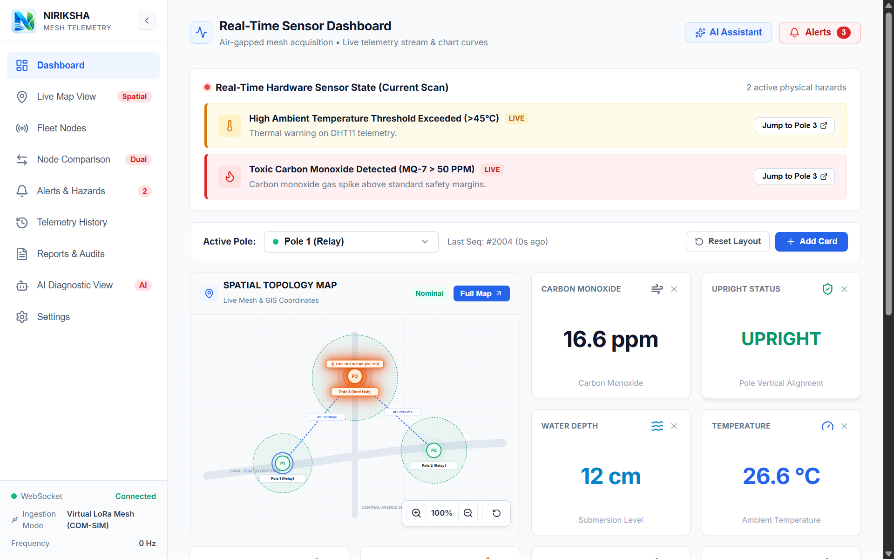](docs/screenshots/dashboard_hazard_banner.png)<br/>*Instant hardware warning banner with direct pole navigation* |

| **Water Electrification Hazard SOS** | **Extreme Thermal Outbreak SOS** |
| :---: | :---: |
| [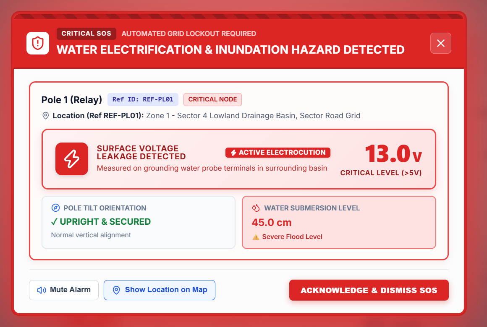](docs/screenshots/alert_electrocution_modal_cutout.png)<br/>*Critical lockout on voltage potential leakage in flood water* | [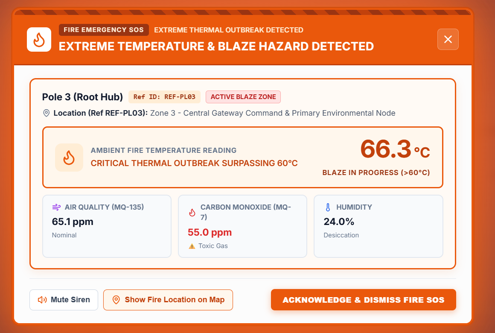](docs/screenshots/alert_fire_modal_cutout.png)<br/>*Audible procedural siren & blaze warning over 60°C* |

| **Geospatial Vector Mesh Topology** | **Fleet Node Architecture & Inventory** |
| :---: | :---: |
| [](docs/screenshots/interactive_map_view.png)<br/>*Vector map with live RF latency metrics and hazard radii* | [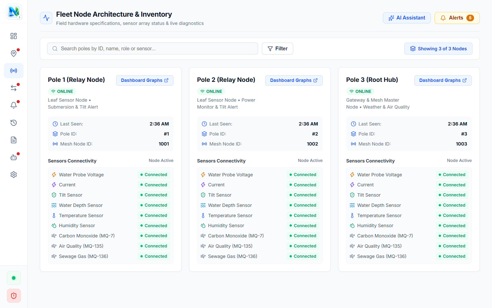](docs/screenshots/fleet_node_inventory.png)<br/>*Multi-node inventory, sensor health, and mesh IDs* |

| **Multi-Node Differential Matrix** | **Dual-Node Time-Series Comparison** |
| :---: | :---: |
| [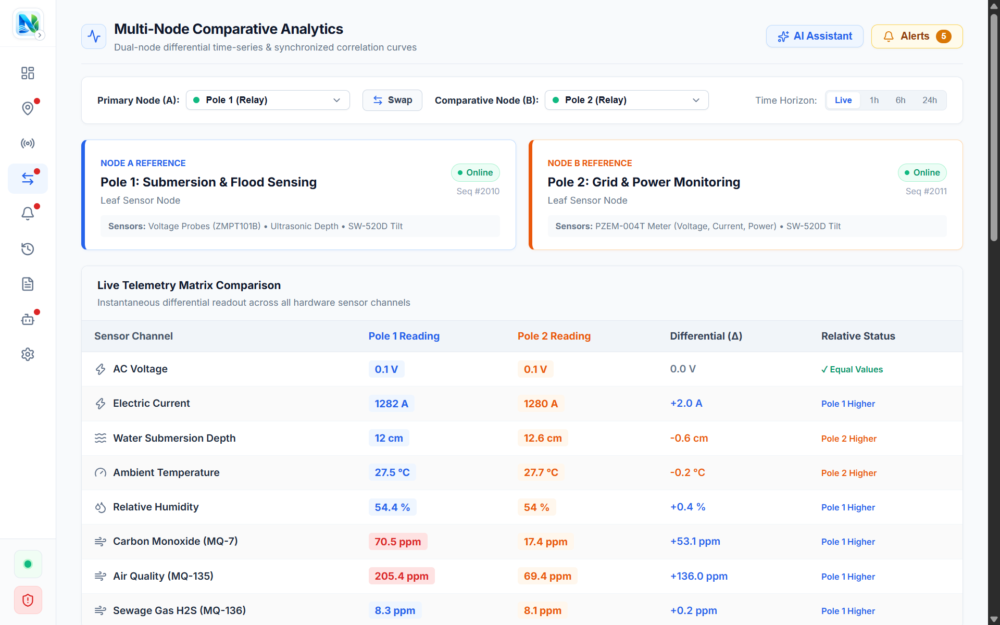](docs/screenshots/comparative_analytics_matrix.png)<br/>*Instantaneous channel differential ($\Delta$) analysis* | [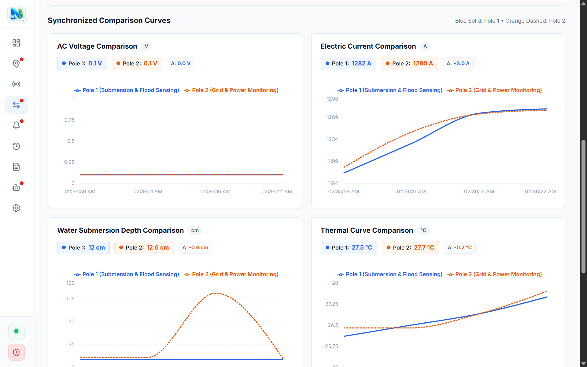](docs/screenshots/comparative_analytics_curves.png)<br/>*Synchronized multi-channel trend lines* |

| **Incident Management & Resolution** | **Historical Telemetry Log Explorer** |
| :---: | :---: |
| [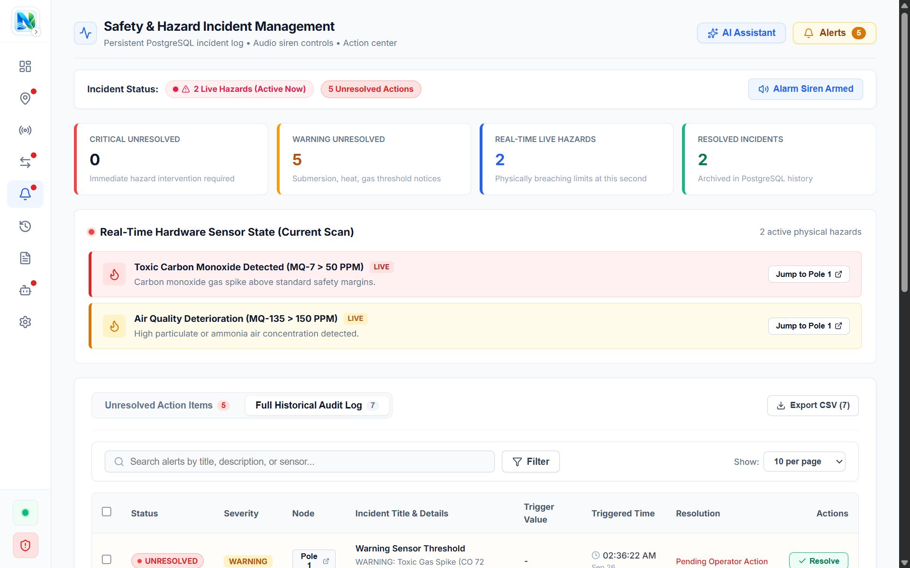](docs/screenshots/incident_management_overview.png)<br/>*PostgreSQL safety log with operator resolution actions* | [](docs/screenshots/telemetry_history_view.png)<br/>*Air-gapped database query explorer and raw JSON inspector* |

| **Compliance Audit & Aggregation** | **Offline Local AI Diagnostic Assistant** |
| :---: | :---: |
| [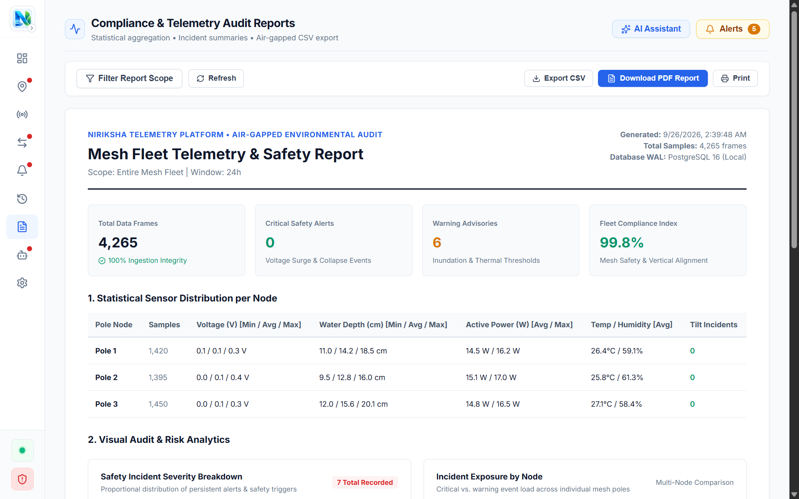](docs/screenshots/compliance_audit_summary.png)<br/>*Statistical Min/Avg/Max distribution and PDF/CSV export* | [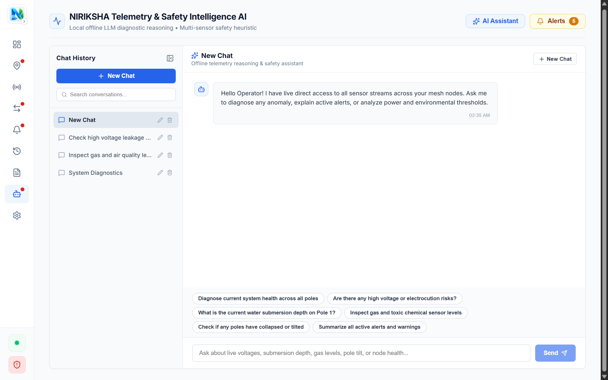](docs/screenshots/ai_diagnostic_assistant.png)<br/>*Self-hosted Ollama LLM diagnostic reasoning console* |

| **System & Hardware Settings** | **Sliding-Window Telemetry Curves** |
| :---: | :---: |
| [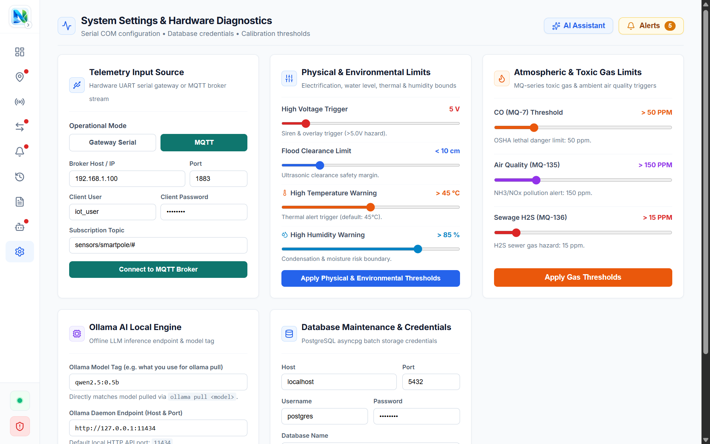](docs/screenshots/system_settings_config.png)<br/>*UART COM port controls, MQTT bridge, and threshold sliders* | [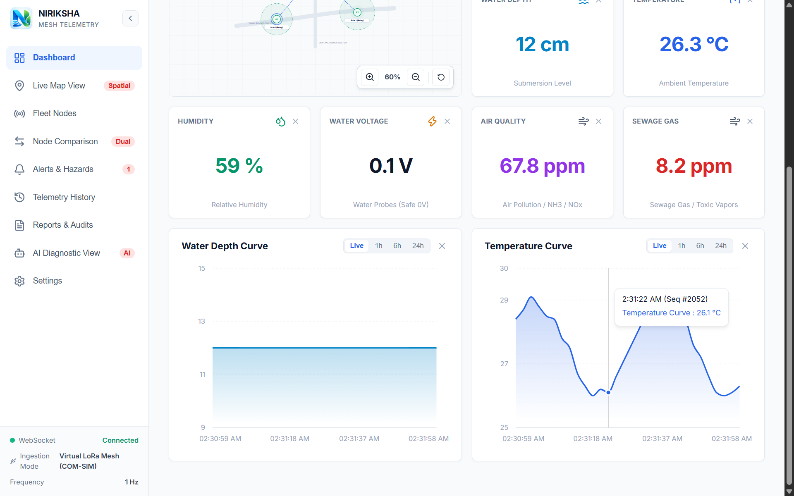](docs/screenshots/dashboard_sensor_charts.png)<br/>*Smooth real-time Recharts curves throttled via rAF* |

---

## 🏛️ System Architecture

The NIRIKSHA architecture spans physical microcontrollers in the field, dual hardware ingestion protocols, an algorithmic signal processing pipeline, and an air-gapped web dashboard.

```mermaid
%%{init: {
  "theme": "base",
  "themeVariables": {
    "fontFamily": "Inter, Segoe UI, Helvetica, Arial, sans-serif",
    "fontSize": "15px",
    "primaryColor": "#ffffff",
    "primaryBorderColor": "#94a3b8",
    "primaryTextColor": "#0f172a",
    "lineColor": "#64748b",
    "clusterBkg": "#f8fafc",
    "clusterBorder": "#cbd5e1",
    "edgeLabelBackground": "#ffffff"
  },
  "flowchart": { "curve": "basis", "htmlLabels": true, "nodeSpacing": 40, "rankSpacing": 55 }
} }%%
flowchart TB

    subgraph FIELD["FIELD LAYER  ·  Wireless Sensor Mesh — painlessMesh 2.4GHz RF"]
        direction LR
        P1["<b>POLE 1</b> — Flood &amp; Submersion Node<br/>─────────────<br/>ZMPT101B · Voltage Leak<br/>HC‑SR04 · Ultrasonic Depth<br/>SW‑520D · Tilt Switch<br/>MQ Gas Array<br/><i>TX interval 2300 ms</i>"]
        P2["<b>POLE 2</b> — Grid &amp; Power Metering Node<br/>─────────────<br/>PZEM‑004T · V / I / W / kWh / PF<br/>SW‑520D · Tilt Switch<br/>MQ Gas Array<br/><i>TX interval 2500 ms</i>"]
        P3["<b>POLE 3</b> — Root Gateway Hub<br/>─────────────<br/>painlessMesh Root Sink<br/>Serial UART Bridge @ 115200 baud"]
        P1 -- "RF mesh hop" --> P3
        P2 -- "RF mesh hop" --> P3
    end

    subgraph INGEST["INGESTION LAYER  ·  FastAPI Backend — Dual Concurrent Protocols"]
        direction LR
        SER["<b>PySerial Worker</b><br/><code>serial_manager.py</code><br/>daemon thread<br/>exponential reconnect backoff"]
        MQ["<b>Async MQTT Ingestor</b><br/><code>mqtt_manager.py</code> · aiomqtt<br/>topic: niriksha/poles/+/telemetry<br/>broker :1883"]
        NORM["<b>Unified Schema Normalizer</b><br/><code>normalizer.py</code><br/>maps payload → canonical schema<br/>inactive sensor → NOT_CONNECTED"]
        SER --> NORM
        MQ --> NORM
    end

    P3 == "USB Serial UART<br/>(COM port)" ==> SER

    subgraph ANALYTICS["ANALYTICS LAYER  ·  Algorithmic Signal Processing Pipeline"]
        direction LR
        KAL["<b>1D Kalman Filter Bank</b><br/><code>kalman.py</code><br/>Q/R‑tuned noise rejection"]
        ANOM["<b>Statistical Anomaly Bank</b><br/><code>anomaly.py</code><br/>EWMA baseline · Z‑score surge<br/>CUSUM drift detection"]
        FUS["<b>Multi‑Sensor Hazard Fusion</b><br/><code>fusion_engine.py</code><br/>Electrocution Risk Index<br/>Fire Combustion Index"]
        KAL --> ANOM --> FUS
    end

    NORM -- "normalized<br/>float stream" --> KAL

    subgraph FANOUT["DISTRIBUTION LAYER  ·  Decoupled Fan‑Out"]
        direction LR
        BUF[("In‑Memory Batch Buffer<br/><code>buffer.py</code><br/>flush @ 250‑300 ms or 50 rows")]
        WS["WebSocket Connection Manager<br/><code>connection_manager.py</code><br/>thread‑safe asyncio broadcast"]
        AI["Offline AI Diagnostics<br/><code>diagnostics.py</code> + <code>ollama.py</code><br/>rule heuristics + local LLM"]
    end

    FUS -- "enriched record" --> BUF
    FUS -- "live broadcast" --> WS
    FUS -- "context snapshot" --> AI

    PG[("PostgreSQL 14+<br/>Time‑Series Store<br/>asyncpg pool · executemany")]
    BUF == "multi‑row batch<br/>transaction" ==> PG

    subgraph CLIENT["CLIENT LAYER  ·  React 19 + Vite Dashboard — Air‑Gapped"]
        direction LR
        SWIN["Sliding Window State<br/>50‑100 pts / metric series"]
        RAF["requestAnimationFrame Throttler<br/>redraw locked to 60 FPS"]
        UI["UI Views<br/>Live Telemetry · Spatial Map<br/>Alerts · Reports · AI Drawer"]
        SWIN --> RAF --> UI
    end

    WS == "WebSocket<br/>/ws/telemetry" ==> SWIN

    classDef pole1 fill:#f0fdf4,stroke:#16a34a,stroke-width:1.5px,color:#14532d;
    classDef pole2 fill:#eff6ff,stroke:#2563eb,stroke-width:1.5px,color:#1e3a5f;
    classDef pole3 fill:#fef3c7,stroke:#d97706,stroke-width:1.5px,color:#78350f;
    classDef ingest fill:#f1f5f9,stroke:#475569,stroke-width:1.5px,color:#1e293b;
    classDef norm fill:#e0e7ff,stroke:#4f46e5,stroke-width:1.5px,color:#312e81;
    classDef analytics fill:#ede9fe,stroke:#7c3aed,stroke-width:1.5px,color:#4c1d95;
    classDef fusion fill:#fee2e2,stroke:#ef4444,stroke-width:1.5px,color:#7f1d1d;
    classDef buffer fill:#fef9c3,stroke:#ca8a04,stroke-width:1.5px,color:#713f12;
    classDef ws fill:#dbeafe,stroke:#2563eb,stroke-width:1.5px,color:#1e3a5f;
    classDef ai fill:#ccfbf1,stroke:#0d9488,stroke-width:1.5px,color:#134e4a;
    classDef storage fill:#dcfce7,stroke:#16a34a,stroke-width:2px,color:#14532d;
    classDef client fill:#f8fafc,stroke:#3b82f6,stroke-width:1.5px,color:#1e3a5f;

    class P1 pole1;
    class P2 pole2;
    class P3 pole3;
    class SER,MQ ingest;
    class NORM norm;
    class KAL,ANOM analytics;
    class FUS fusion;
    class BUF buffer;
    class WS ws;
    class AI ai;
    class PG storage;
    class SWIN,RAF,UI client;

    style FIELD fill:#ffffff,stroke:#cbd5e1,stroke-width:1px
    style INGEST fill:#ffffff,stroke:#cbd5e1,stroke-width:1px
    style ANALYTICS fill:#ffffff,stroke:#cbd5e1,stroke-width:1px
    style FANOUT fill:#ffffff,stroke:#cbd5e1,stroke-width:1px
    style CLIENT fill:#ffffff,stroke:#cbd5e1,stroke-width:1px
```

### Core Subsystems

1. **Hardware & Radio Mesh (`firmware/`):**
   - Node 1 (Flood & Voltage): HC-SR04 ultrasonic distance, ZMPT101B AC voltage probe, SW-520D tilt switch, MQ gas array.
   - Node 2 (Grid & Gas): PZEM-004T AC energy meter (V, I, W, kWh, PF), SW-520D tilt switch, MQ gas array.
   - Node 3 (Root Gateway): painlessMesh root coordinator, aggregates frames and outputs normalized serial lines to the host machine.

2. **Dual-Protocol Ingestion Layer (`backend/app/protocols/`):**
   - **Serial Manager:** Dedicated daemon thread reading UART lines (`MESH_JSON:{...}`) with automatic reconnection and exponential backoff.
   - **MQTT Manager:** Non-blocking async subscriber (`aiomqtt`) listening to topics like `niriksha/poles/+/telemetry`.

3. **Algorithmic Analytics Pipeline (`backend/app/analytics/`):**
   - **1D Kalman Filtering:** Minimizes mean squared error on analog signals, eliminating ripples on water probes and ADC noise.
   - **Streaming Anomaly Detection:** Calculates dynamic baselines using EWMA variance and tracks persistent drift using two-sided CUSUM.
   - **Multi-Sensor Hazard Fusion:** Computes the composite Electrocution Risk Index ($0-100\%$), Fire & Combustion Index, and applies a multi-frame debounce on tilt switches.

4. **Persistence & Database Buffering (`backend/app/db/`):**
   - Decoupled in-memory batch ring buffer collecting telemetry records.
   - Flushes to PostgreSQL every 250-300 ms or upon reaching 50 records in batched multi-row transactions via an `asyncpg` connection pool.

5. **Local AI Diagnostic Assistant (`backend/app/ai/`):**
   - Tier 1: Deterministic safety heuristics providing instant, reliable hazard verification.
   - Tier 2: Local LLM runtime powered by Ollama (`qwen2.5:0.5b` or `llama3.2:1b`) with dynamic real-time telemetry prompt injection.

6. **Web Operations Dashboard (`frontend/`):**
   - React 19 + Vite + TypeScript interface styled with clean slate laboratory aesthetics.
   - Sliding window memory management (50-100 data points) and `requestAnimationFrame` throttling for stable 24/7 operation.
   - Procedural dual-tone emergency siren synthesizer using the Web Audio API.

---

## ⚡ Quick Start & Installation

Follow these steps to set up and run the entire platform locally on Windows or Linux.

### Prerequisites

| Requirement | Minimum Version | Note |
| :--- | :--- | :--- |
| **Python** | 3.10+ | Required for backend services |
| **Node.js** | 18.0+ | Required for the React dashboard |
| **PostgreSQL** | 14.0+ | Time-series telemetry and alert storage |
| **PowerShell** | 5.1+ / 7+ | For running the service manager (`manage.ps1`) |
| **Ollama** *(Optional)* | Latest | For local offline AI assistant features |

---

### Step 1: Clone Repository

```bash
git clone https://github.com/your-username/SIH.git
cd SIH
```

---

### Step 2: Database Setup

1. Make sure PostgreSQL is running on your machine (default port `5432`).
2. Create the target database (e.g. `iot_dashboard`):
   ```sql
   CREATE DATABASE iot_dashboard;
   ```
3. Initialize the database schema and indexes:
   ```powershell
   python backend/init_postgres.py
   ```

---

### Step 3: Configure Environment Variables

The backend ships with pre-configured settings in `backend/.env`. You can adjust credentials as needed:

```env
# backend/.env

# PostgreSQL Database Configuration
DB_HOST=127.0.0.1
DB_PORT=5432
DB_USER=postgres
DB_PASSWORD=postgres
DB_NAME=iot_dashboard
DB_MIN_POOL_SIZE=2
DB_MAX_POOL_SIZE=10

# Ingestion Batch Flush Settings
BATCH_FLUSH_INTERVAL_MS=300
BATCH_BUFFER_MAX_SIZE=50

# Server Configuration
SERVER_HOST=127.0.0.1
SERVER_PORT=8000

# Physical Serial COM (Leave blank for auto-scan or specify e.g. COM3)
SERIAL_PORT=
SERIAL_BAUD=115200

# Industrial MQTT Broker Configuration
MQTT_ENABLED=true
MQTT_BROKER_HOST=localhost
MQTT_BROKER_PORT=1883
MQTT_TOPIC=niriksha/poles/+/telemetry

# Local Ollama AI Settings
OLLAMA_HOST=http://127.0.0.1:11434
OLLAMA_MODEL=qwen2.5:0.5b
```

---

### Step 4: Install Dependencies

```powershell
# 1. Install Backend Dependencies
pip install -r backend/requirements.txt

# 2. Install Frontend Dependencies
cd frontend
npm install
cd ..
```

---

### Step 5: Run the Platform

#### Method A: Using the Management CLI (Recommended)

NIRIKSHA includes a unified PowerShell management script `manage.ps1` to orchestrate background processes:

```powershell
# Start all services (Backend, Frontend, and Ollama)
.\manage.ps1 start

# Check service health and port statuses
.\manage.ps1 status

# Stream live backend log output
.\manage.ps1 logs

# Stop all running services
.\manage.ps1 stop
```

#### Method B: Starting Services Manually

If you prefer running services in separate terminal windows:

```powershell
# Terminal 1: Backend API
cd backend
python main.py

# Terminal 2: Frontend Dashboard
cd frontend
npm run dev
```

---

## 🌐 Application Access Points

Once services are running, access the interfaces:

| Service | URL | Description |
| :--- | :--- | :--- |
| **Operations Dashboard** | [http://localhost:5173](http://localhost:5173) | Primary operator control center |
| **Backend REST API** | [http://127.0.0.1:8000](http://127.0.0.1:8000) | Health and telemetry endpoints |
| **Interactive API Docs (Local)** | [http://127.0.0.1:8000/docs](http://127.0.0.1:8000/docs) | Swagger UI for local REST endpoints |
| **Published API Docs (Online)** | [NIRIKSHA API Documentation](https://om29dev.github.io/niriksha/docs/) | Hosted static OpenAPI reference |
| **WebSocket Stream** | `ws://127.0.0.1:8000/ws/telemetry` | Real-time sensor stream |

---

## 🧪 Testing & Verification

The backend analytics, signal filters, and hazard rules are thoroughly verified with unit and integration tests:

```powershell
# Run the automated test suite
python -m pytest backend/tests/ -v
```

Test coverage includes:
- **Kalman Filter:** Initialization, noise attenuation, convergence, and channel isolation.
- **Anomaly Detection:** EWMA dynamic baseline tracking, Z-score surge flagging, and CUSUM drift accumulation.
- **Hazard Fusion:** Electrocution Risk Index calculations, Fire Combustion Index, and tilt debounce confirmation.
- **Packet Normalizer:** Schema mapping, missing sensor fallback (`NOT_CONNECTED`), and raw ADC scaling.
- **API Endpoints:** REST routes and WebSocket health checks.

---

## 📂 Project Structure

```
SIH/
├── backend/                       # Python FastAPI backend service
│   ├── app/
│   │   ├── ai/                    # Offline AI heuristics & Ollama client
│   │   ├── analytics/             # Kalman filter, EWMA/CUSUM, hazard fusion
│   │   ├── core/                  # Configuration & settings (.env loader)
│   │   ├── db/                    # asyncpg connection pool, schema, batch buffer
│   │   ├── protocols/             # PySerial worker, MQTT subscriber, normalizer
│   │   └── routers/               # Telemetry, alerts, ports, websockets, AI
│   ├── tests/                     # Automated unit and integration test suite
│   ├── init_postgres.py           # Database table initialization script
│   ├── main.py                    # Server entrypoint and lifespan manager
│   └── requirements.txt           # Python dependencies
│
├── frontend/                      # React 19 + TypeScript + Vite web dashboard
│   ├── src/
│   │   ├── components/            # Modular views, charts, maps, modals, AI drawer
│   │   ├── hooks/                 # WebSocket hook, alerts hook, Web Audio siren hook
│   │   ├── constants/             # Pole catalog, danger thresholds
│   │   ├── types/                 # Shared TypeScript interfaces
│   │   ├── App.tsx                # Main view router and layout
│   │   └── main.tsx               # Client entry point
│   ├── package.json               # Node packages and scripts
│   └── vite.config.ts             # Vite build configuration
│
├── firmware/                      # Microcontroller C++ sketches (ESP32)
│   ├── pole1_sensor_node/         # Pole 1 firmware: Ultrasonic, ZMPT101B, Tilt, Gas
│   ├── pole2_sensor_node/         # Pole 2 firmware: PZEM-004T, Tilt, Gas
│   ├── pole3_gateway_hub/         # Pole 3 firmware: Root Hub Gateway & UART Serial
│   └── README.md                  # Embedded hardware and flashing documentation
│
├── docs/                          # Comprehensive technical documentation chapters
│   ├── 01_SYSTEM_ARCHITECTURE.md  # High-level architecture, D2 pipeline, data flow
│   ├── 02_HARDWARE_AND_MESH.md    # Pinouts, painlessMesh RF protocol, calibration
│   ├── 03_INGESTION_AND_PROTOCOLS.md # PySerial thread, MQTT client, normalizer
│   ├── 04_ANALYTICS_AND_ALGORITHMS.md # Kalman filter state math, EWMA, CUSUM, fusion
│   ├── 05_DATABASE_AND_STORAGE.md # PostgreSQL schema, indexing, batch buffering
│   ├── 06_FRONTEND_AND_DASHBOARD.md # React 19 architecture, 60fps rendering, audio siren
│   ├── 07_AI_DIAGNOSTICS_ENGINE.md # Deterministic rules, Ollama integration
│   ├── 08_OPERATIONS_AND_RUNBOOK.md # PowerShell CLI, runbooks, troubleshooting
│   ├── 09_MODULAR_COMPONENTS.md   # Modular component reference & design principles
│   └── README.md                  # Documentation index & technical matrix
│
├── logs/                          # Runtime logs generated by services
├── manage.ps1                     # Unified PowerShell service management CLI
└── ARCHITECTURE.md                # System topology and D2 data flow diagrams
```

---

## 📖 Subsystem Documentation

For deep technical details, circuit schematics, mathematical equations, and operational procedures, refer to the documentation chapters:

- **[System Architecture](file:///d:/proj/SIH/docs/01_SYSTEM_ARCHITECTURE.md)**: End-to-end topology, fault boundaries, and concurrency model.
- **[Hardware & Radio Mesh](file:///d:/proj/SIH/docs/02_HARDWARE_AND_MESH.md)**: ESP32 pin assignments, painlessMesh protocol, transmission cadence, and sensor calibration.
- **[Ingestion & Protocols](file:///d:/proj/SIH/docs/03_INGESTION_AND_PROTOCOLS.md)**: Serial UART worker, MQTT subscriber, packet normalizer, and error recovery.
- **[Analytics & Algorithms](file:///d:/proj/SIH/docs/04_ANALYTICS_AND_ALGORITHMS.md)**: 1D Kalman filter formulas, streaming EWMA/CUSUM anomaly detection, and composite risk scoring.
- **[Database & Storage](file:///d:/proj/SIH/docs/05_DATABASE_AND_STORAGE.md)**: PostgreSQL table schemas, indexes, asyncpg pooling, and memory batch buffering.
- **[Frontend Architecture](file:///d:/proj/SIH/docs/06_FRONTEND_AND_DASHBOARD.md)**: React 19 dashboard, sliding-window buffer, and procedural Web Audio sirens.
- **[Offline AI Diagnostics](file:///d:/proj/SIH/docs/07_AI_DIAGNOSTICS_ENGINE.md)**: Deterministic heuristic safety matrix and local Ollama model integration.
- **[Operations & Runbook](file:///d:/proj/SIH/docs/08_OPERATIONS_AND_RUNBOOK.md)**: Management CLI commands, environment options, port allocations, and troubleshooting.
- **[Modular Components](file:///d:/proj/SIH/docs/09_MODULAR_COMPONENTS.md)**: Frontend subcomponents, backend packages, and single-responsibility layout.
- **[Full Documentation Hub](file:///d:/proj/SIH/docs/README.md)**: Master documentation index.
- **[NIRIKSHA API Documentation](https://om29dev.github.io/niriksha/docs/)**: Interactive OpenAPI / Swagger documentation hosted on GitHub Pages.
