# 01. System Architecture & Topology

NIRIKSHA is an offline-capable, distributed environmental intelligence and hazard monitoring platform. The system is engineered to provide continuous situational awareness across disaster-prone areas, urban corridors, and industrial zones where public cloud or cellular networks may be disrupted during extreme weather events.

---

## 1. High-Level System Architecture

The following Mermaid diagram illustrates the complete end-to-end data pipeline: from physical sensor instrumentation on urban utility poles to real-time browser rendering and local database persistence.

```mermaid
%%{init: {
  "theme": "base",
  "themeVariables": {
    "fontFamily": "Inter, Segoe UI, Helvetica, Arial, sans-serif",
    "fontSize": "15px",
    "primaryColor": "#ffffff",
    "primaryBorderColor": "#94a3b8",
    "primaryTextColor": "#0f172a",
    "lineColor": "#64748b",
    "clusterBkg": "#f8fafc",
    "clusterBorder": "#cbd5e1",
    "edgeLabelBackground": "#ffffff"
  },
  "flowchart": { "curve": "basis", "htmlLabels": true, "nodeSpacing": 40, "rankSpacing": 55 }
} }%%
flowchart TB

    subgraph FIELD["FIELD LAYER  ·  Wireless Sensor Mesh — painlessMesh 2.4GHz RF"]
        direction LR
        P1["<b>POLE 1</b> — Flood &amp; Submersion Node<br/>─────────────<br/>ZMPT101B · Voltage Leak<br/>HC‑SR04 · Ultrasonic Depth<br/>SW‑520D · Tilt Switch<br/>MQ Gas Array<br/><i>TX interval 2300 ms</i>"]
        P2["<b>POLE 2</b> — Grid &amp; Power Metering Node<br/>─────────────<br/>PZEM‑004T · V / I / W / kWh / PF<br/>SW‑520D · Tilt Switch<br/>MQ Gas Array<br/><i>TX interval 2500 ms</i>"]
        P3["<b>POLE 3</b> — Root Gateway Hub<br/>─────────────<br/>painlessMesh Root Sink<br/>Serial UART Bridge @ 115200 baud"]
        P1 -- "RF mesh hop" --> P3
        P2 -- "RF mesh hop" --> P3
    end

    subgraph INGEST["INGESTION LAYER  ·  FastAPI Backend — Dual Concurrent Protocols"]
        direction LR
        SER["<b>PySerial Worker</b><br/><code>serial_manager.py</code><br/>daemon thread<br/>exponential reconnect backoff"]
        MQ["<b>Async MQTT Ingestor</b><br/><code>mqtt_manager.py</code> · aiomqtt<br/>topic: niriksha/poles/+/telemetry<br/>broker :1883"]
        NORM["<b>Unified Schema Normalizer</b><br/><code>normalizer.py</code><br/>maps payload → canonical schema<br/>inactive sensor → NOT_CONNECTED"]
        SER --> NORM
        MQ --> NORM
    end

    P3 == "USB Serial UART<br/>(COM port)" ==> SER

    subgraph ANALYTICS["ANALYTICS LAYER  ·  Algorithmic Signal Processing Pipeline"]
        direction LR
        KAL["<b>1D Kalman Filter Bank</b><br/><code>kalman.py</code><br/>Q/R‑tuned noise rejection"]
        ANOM["<b>Statistical Anomaly Bank</b><br/><code>anomaly.py</code><br/>EWMA baseline · Z‑score surge<br/>CUSUM drift detection"]
        FUS["<b>Multi‑Sensor Hazard Fusion</b><br/><code>fusion_engine.py</code><br/>Electrocution Risk Index<br/>Fire Combustion Index"]
        KAL --> ANOM --> FUS
    end

    NORM -- "normalized<br/>float stream" --> KAL

    subgraph FANOUT["DISTRIBUTION LAYER  ·  Decoupled Fan‑Out"]
        direction LR
        BUF[("In‑Memory Batch Buffer<br/><code>buffer.py</code><br/>flush @ 250‑300 ms or 50 rows")]
        WS["WebSocket Connection Manager<br/><code>connection_manager.py</code><br/>thread‑safe asyncio broadcast"]
        AI["Offline AI Diagnostics<br/><code>diagnostics.py</code> + <code>ollama.py</code><br/>rule heuristics + local LLM"]
    end

    FUS -- "enriched record" --> BUF
    FUS -- "live broadcast" --> WS
    FUS -- "context snapshot" --> AI

    PG[("PostgreSQL 14+<br/>Time‑Series Store<br/>asyncpg pool · executemany")]
    BUF == "multi‑row batch<br/>transaction" ==> PG

    subgraph CLIENT["CLIENT LAYER  ·  React 19 + Vite Dashboard — Air‑Gapped"]
        direction LR
        SWIN["Sliding Window State<br/>50‑100 pts / metric series"]
        RAF["requestAnimationFrame Throttler<br/>redraw locked to 60 FPS"]
        UI["UI Views<br/>Live Telemetry · Spatial Map<br/>Alerts · Reports · AI Drawer"]
        SWIN --> RAF --> UI
    end

    WS == "WebSocket<br/>/ws/telemetry" ==> SWIN

    classDef pole1 fill:#f0fdf4,stroke:#16a34a,stroke-width:1.5px,color:#14532d;
    classDef pole2 fill:#eff6ff,stroke:#2563eb,stroke-width:1.5px,color:#1e3a5f;
    classDef pole3 fill:#fef3c7,stroke:#d97706,stroke-width:1.5px,color:#78350f;
    classDef ingest fill:#f1f5f9,stroke:#475569,stroke-width:1.5px,color:#1e293b;
    classDef norm fill:#e0e7ff,stroke:#4f46e5,stroke-width:1.5px,color:#312e81;
    classDef analytics fill:#ede9fe,stroke:#7c3aed,stroke-width:1.5px,color:#4c1d95;
    classDef fusion fill:#fee2e2,stroke:#ef4444,stroke-width:1.5px,color:#7f1d1d;
    classDef buffer fill:#fef9c3,stroke:#ca8a04,stroke-width:1.5px,color:#713f12;
    classDef ws fill:#dbeafe,stroke:#2563eb,stroke-width:1.5px,color:#1e3a5f;
    classDef ai fill:#ccfbf1,stroke:#0d9488,stroke-width:1.5px,color:#134e4a;
    classDef storage fill:#dcfce7,stroke:#16a34a,stroke-width:2px,color:#14532d;
    classDef client fill:#f8fafc,stroke:#3b82f6,stroke-width:1.5px,color:#1e3a5f;

    class P1 pole1;
    class P2 pole2;
    class P3 pole3;
    class SER,MQ ingest;
    class NORM norm;
    class KAL,ANOM analytics;
    class FUS fusion;
    class BUF buffer;
    class WS ws;
    class AI ai;
    class PG storage;
    class SWIN,RAF,UI client;

    style FIELD fill:#ffffff,stroke:#cbd5e1,stroke-width:1px
    style INGEST fill:#ffffff,stroke:#cbd5e1,stroke-width:1px
    style ANALYTICS fill:#ffffff,stroke:#cbd5e1,stroke-width:1px
    style FANOUT fill:#ffffff,stroke:#cbd5e1,stroke-width:1px
    style CLIENT fill:#ffffff,stroke:#cbd5e1,stroke-width:1px
```



---

## 2. Core Architectural Design Principles

### 2.1 Strict Air-Gap Isolation
Municipal command centers and utility substations frequently operate in classified or severed network environments. The NIRIKSHA architecture prohibits any outbound network requests:
- **Zero CDN Dependencies**: No runtime links to `unpkg.com`, `cdnjs.cloudflare.com`, or Google Fonts.
- **Local Typography & Icons**: Typography is bundled at build time via `@fontsource/inter` and icons are statically compiled SVG components from `lucide-react`.
- **Local Procedural Audio**: Acoustic sirens and warning tones do not rely on remote MP3/WAV assets; they are synthesized procedurally in the browser via the Web Audio API (`AudioContext` oscillators).
- **Offline Machine Reasoning**: Sensor diagnosis and natural language auditing run entirely on-premises using local Ollama LLM instances or rule-based deterministic heuristic engines.

### 2.2 Dual Ingestion Concurrency
Telemetry ingestion must never halt when a physical cable is unplugged or when network routing flips. NIRIKSHA deploys two concurrent, independent ingestion protocols:
1. **PySerial Gateway**: Communicates over a physical USB/UART connection with the Pole 3 Root Hub. A dedicated background thread continuously reads lines, handles framing, and implements exponential backoff reconnection if the serial port disconnects.
2. **Industrial MQTT Broker**: An asynchronous `aiomqtt` client connects to a local or edge broker (e.g., Mosquitto on port 1883) and subscribes to `niriksha/poles/+/telemetry`. This enables distributed field gateways to publish over cellular or Ethernet backhauls directly into the backend.

### 2.3 Decoupled In-Memory Batch Buffering
In high-frequency IoT environments, executing a single SQL `INSERT` statement per arriving telemetry packet introduces severe transaction overhead, lock contention, and asyncio event-loop starvation.
- **Buffer Mechanism**: Incoming telemetry packets pass through analytics and enter an in-memory queue (`app/db/buffer.py`).
- **Flushing Heuristics**: The buffer automatically flushes to PostgreSQL when either:
  1. The buffer reaches `BATCH_BUFFER_MAX_SIZE` (default: 50 records), or
  2. The elapsed time exceeds `BATCH_FLUSH_INTERVAL_MS` (default: 300 ms).
- **Execution**: Flushes use `asyncpg.Connection.executemany` within a single short-lived transaction, achieving throughput exceeding 5,000 packets/second while keeping pool acquisition times under 2 milliseconds.

### 2.4 Browser Rendering Performance (Sliding Window & RAF)
Continuous, 24/7 telemetry monitoring dashboards often suffer from memory leaks and browser tab crashes caused by unbounded DOM node creation or excessive SVG redraws. NIRIKSHA solves this through two deterministic mechanisms:
1. **Sliding Window Buffer**: The frontend state retains a fixed sliding window of historical points (typically 50-100 samples per metric). As new packets arrive, older entries are sliced off, capping memory footprint at constant space $O(1)$.
2. **`requestAnimationFrame` Throttling**: When telemetry arrives at 20-50 Hz from multiple nodes, the frontend does not trigger React state updates for every single packet. Instead, packets are enqueued in a lightweight reference buffer, and a `requestAnimationFrame` loop flushes updates to state at the monitor's native refresh rate (60 Hz), eliminating frame drop and UI freeze.

---

## 3. Data Flow & Lifecycle Matrix

The table below traces a telemetry metric from physical transducer conversion to operator view:

| Stage | Subsystem | File Reference | Latency | Primary Responsibility |
| :--- | :--- | :--- | :--- | :--- |
| **1. Transduction** | Microcontroller Hardware | `firmware/pole1_sensor_node/` | < 1 ms | Analog sensor sampling (ADC 12-bit) and timer interrupts. |
| **2. Mesh Routing** | painlessMesh 2.4GHz RF | `firmware/pole1_sensor_node/` | 15-40 ms | ESP-NOW wireless mesh routing with staggered transmission. |
| **3. Hub Serializing**| ESP32 Gateway Node | `firmware/pole3_gateway_hub/` | 2 ms | Root sink JSON encapsulation and UART TX (`MESH_JSON:`). |
| **4. Host Ingestion** | PySerial / aiomqtt | `app/protocols/` | 1-5 ms | Non-blocking line reading, frame stripping, payload decoding. |
| **5. Normalization** | Schema Normalizer | `app/protocols/normalizer.py`| < 0.5 ms | Schema alignment, inactive sensor `NOT_CONNECTED` flagging. |
| **6. Signal Filtering**| 1D Kalman Filter | `app/analytics/kalman.py` | < 0.2 ms | Process noise rejection on analog ADC and ultrasonic depth. |
| **7. Anomaly & Fusion**| Anomaly Bank & Fusion | `app/analytics/fusion_engine.py`|< 0.5 ms | Z-score surge check, CUSUM drift, Electrocution Risk Index. |
| **8. Memory Buffer** | In-Memory Batch Queue | `app/db/buffer.py` | 0-300 ms | Temporal batching before multi-row database write. |
| **9. Persistence** | asyncpg Pool & PostgreSQL | `app/db/telemetry_repo.py` | 2-8 ms | Multi-row batch transaction commit with indexed columns. |
| **10. WebSocket Push**| Connection Manager | `app/connection_manager.py` | 1-3 ms | Async broadcasting to active browser clients. |
| **11. RAF Dispatch** | Client Sliding Window | `frontend/src/hooks/` | 16 ms | RAF synchronization, metric sliding window slice(-100). |
| **12. UI Render** | Recharts / SVG Schematic | `frontend/src/components/` | 16 ms | Canvas draw, acoustic hazard siren trigger, DOM update. |

---

## 4. Fault Domain Isolation & Graceful Degradation

The platform implements strict boundary isolation so that failures in one tier do not cascade:

```d2
direction: down

fault_tree: Failure Isolation Architecture {
  style.fill: "#ffffff"
  style.stroke: "#e2e8f0"

  serial_fail: Physical USB Cable Disconnected {
    shape: rectangle
    style.fill: "#fee2e2"
    style.stroke: "#ef4444"
  }

  serial_handler: PySerial Exponential Backoff Loop {
    shape: step
    style.fill: "#fef3c7"
    style.stroke: "#f59e0b"
    desc: "Retries COM port scan every 1-2s; backend does NOT crash"
  }

  mqtt_active: MQTT Broker Continues Ingestion {
    shape: rectangle
    style.fill: "#dcfce7"
    style.stroke: "#16a34a"
    desc: "Secondary telemetry path maintains full ingestion"
  }

  serial_fail -> serial_handler: "Triggers SerialException"
  serial_fail -> mqtt_active: "Zero impact on MQTT protocol"

  db_down: PostgreSQL Database Unreachable {
    shape: rectangle
    style.fill: "#fee2e2"
    style.stroke: "#ef4444"
  }

  db_handler: Buffer Ring Retention & WebSocket Passthrough {
    shape: step
    style.fill: "#fef3c7"
    style.stroke: "#f59e0b"
    desc: "Live WebSockets continue streaming; DB flushes retry on re-auth"
  }

  db_down -> db_handler: "Pool reconnects in background"

  ollama_offline: Ollama LLM Service Stopped {
    shape: rectangle
    style.fill: "#fee2e2"
    style.stroke: "#ef4444"
  }

  heuristic_fallback: Deterministic Rule Diagnostics {
    shape: step
    style.fill: "#dbeafe"
    style.stroke: "#2563eb"
    desc: "Heuristics evaluate immediately (0ms); operator receives rule report"
  }

  ollama_offline -> heuristic_fallback: "Circuit breaker routes to rule engine"
}
```

1. **Hardware Disconnection**: If the Root Gateway USB cable is detached, `serial_manager.py` catches `serial.SerialException`, logs the event, and enters an automatic retry loop. The FastAPI server and WebSocket broadcasts remain fully operational.
2. **Database Outage**: If PostgreSQL restarts or drops connections, the in-memory batch buffer retains the most recent records, while the `asyncpg` pool automatically attempts re-authentication. Real-time WebSocket broadcasting continues uninterrupted.
3. **AI Inference Timeout**: If the local Ollama LLM is busy or uninstalled, the AI assistant gracefully falls back to the deterministic diagnostic heuristic engine (`app/ai/diagnostics.py`), ensuring safety-critical rule evaluations never stall.
